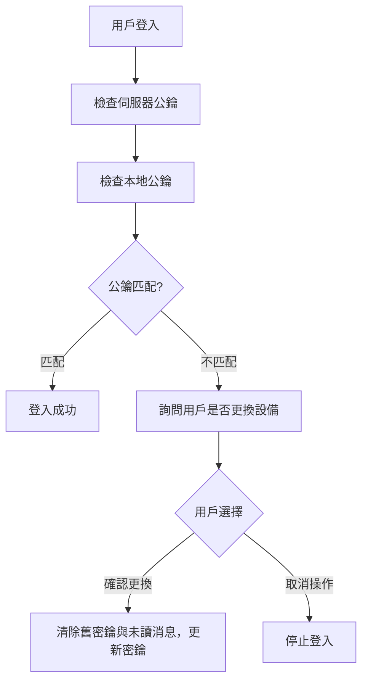
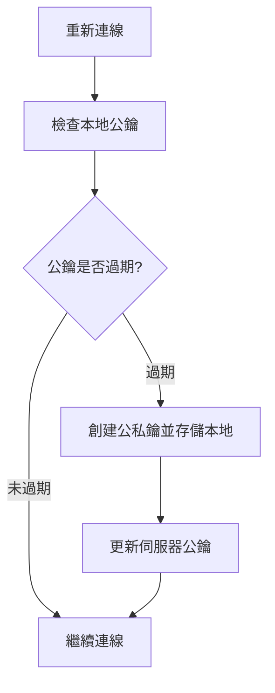
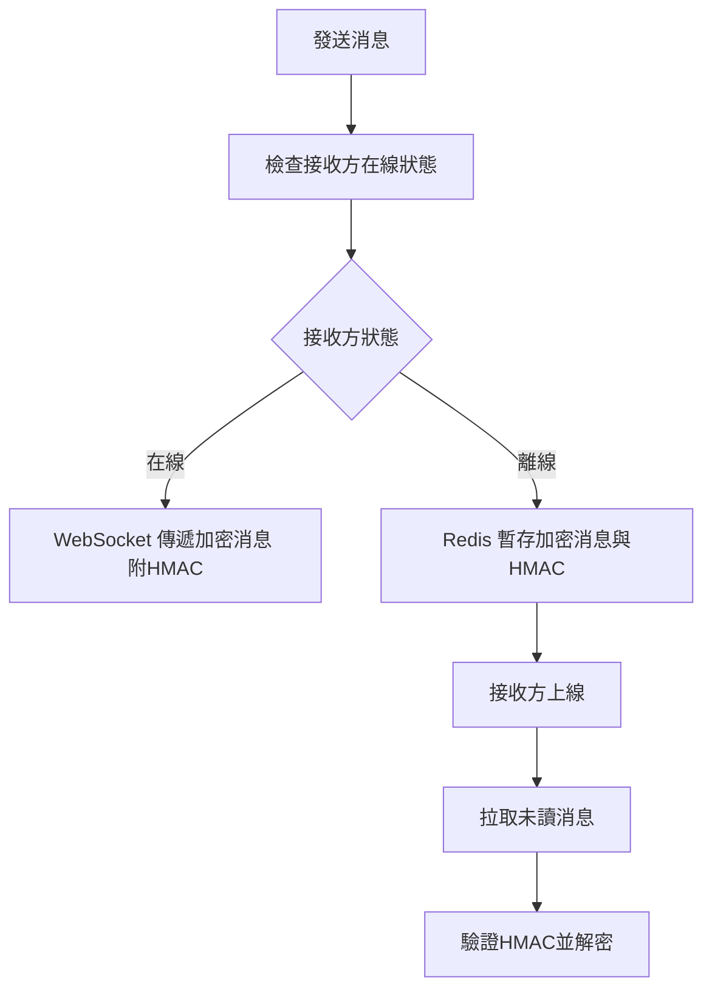

# E2EE Chat: 端對端即時訊息範例
> [!NOTE]
> 凌晨突然想到的架構，抽空補上實作範例。<br>
> 架構僅供參考，只是先把大概構思流程，但未實作不知道會遇到什麼問題。<br>
> 後續會提供以下內容：
> - Node.js 實作後端
> - HTML / JavaScript 實作網頁端
> - Swift 實作 iOS 端的範例
> - dockerfile 方便一鍵部署測試

## 系統結構

### 功能

#### 用戶密鑰管理
- 本地生成公私鑰。
- 私鑰僅存儲於本地，公鑰上傳至伺服器。
- 連線時檢查本地公鑰與伺服器公鑰的匹配性。
- 公私鑰過期時自動更新密鑰，並通知伺服器。

#### 消息傳遞
- 雙方在線時通過 WebSocket 傳遞加密消息，附帶 HMAC 和公鑰指紋。
- 一方離線時，消息暫存於伺服器，等待接收方上線後傳遞。

#### 未讀消息管理
- 未讀消息存儲於伺服器的臨時存儲 (Redis)，過期未讀取 (7 日) 自動刪除。
- 消息讀取後立即從伺服器移除。
- 更換設備時刪除與舊密鑰相關的所有未讀消息。

#### 用戶設備管理
- 每次重新連線時檢查本地公鑰是否與伺服器公鑰匹配。
- 公鑰不匹配時詢問用戶是否要更換設備：
  - 若用戶確認，清除舊密鑰與所有未讀消息，並生成新密鑰對。
  - 若用戶取消，停止登入並保留現有密鑰。

### 流程

#### 用戶登入
- 用戶登入時，伺服器返回綁定的公鑰。
- 檢查本地是否存有匹配的公鑰：
  - 匹配：直接登入並同步伺服器中的未讀消息。
  - 不匹配：
    - 提示用戶：
      - 確認更換設備：清除本地舊密鑰與歷史消息，生成新密鑰並同步至伺服器。
      - 取消操作：停止登入流程，保持現有狀態。

#### 消息傳遞
- 發送方檢查接收方在線狀態：
    - 在線：
      - 發送方從伺服器獲取接收方的最新公鑰。
      - 使用接收方公鑰加密消息，附帶消息的 HMAC 和加密公鑰指紋。
      - 通過 WebSocket 傳遞消息至接收方。
    - 離線：
      - 發送方加密消息後上傳至伺服器，伺服器存儲消息內容、HMAC 和加密公鑰指紋。
      - 接收方上線後，伺服器推送未讀消息，接收方使用本地私鑰解密。

#### 消息解密
- 用戶上線後，從伺服器獲取未讀消息及其加密公鑰指紋。
- 使用本地私鑰解密消息並驗證 HMAC：
- HMAC 驗證通過：消息成功解密並顯示給用戶。
- 驗證失敗：忽略該消息並記錄錯誤。

#### 更換設備
- 當本地公鑰與伺服器不匹配時，提示用戶選擇：
  - 確認更換設備：
    - 清除本地舊密鑰與伺服器中未讀消息。
    - 生成新密鑰對並更新伺服器上的公鑰。
  - 取消操作：
    - 停止登入流程，保留現有密鑰與數據。
    - 若確認更換，系統通知伺服器刪除與舊公鑰相關的所有數據。

### 模組

#### 密鑰管理
- 生成密鑰：使用 RSA-OAEP 算法 (2048 位) 生成密鑰對。
- 本地存儲：將公鑰與私鑰存於安全存儲 (IndexedDB)。
- 伺服器同步：僅上傳公鑰，伺服器不存儲私鑰。
- 密鑰更新：公私鑰過期 (14日) 或設備更換時，系統自動更新密鑰，並保留最新兩組密鑰。

#### 消息傳遞
- 消息結構：
  ```JSON
  {
    "senderId": "user123",
    "receiverId": "user456",
    "encryptedMessage": "(加密訊息)",
    "hmac": "(消息HMAC)",
    "fingerprint": "(公鑰指紋)",
    "timestamp": "2024-12-29T12:00:00Z"
  }
  ```
- 在線傳遞：通過 WebSocket，確保實時性與低延遲。
- 離線存儲：使用 Redis 暫存消息，並設置自動過期時間 (7 日)。

#### 用戶登入檢查
- 登入時，伺服器返回當前綁定的公鑰。
- 比對本地公鑰：
  - 匹配：允許登入。
  - 不匹配：詢問用戶是否更換設備。
- 邏輯：
  - 公鑰匹配時視為同一設備。
  - 公鑰不匹配時，詢問用戶是否更換設備或取消操作。

#### 未讀消息管理模組
- 存儲：使用 Redis 的 List 結構，每個用戶維護獨立的未讀消息列表。
- 刪除：
  - 消息成功接收後從伺服器刪除。
  - 設備更換時刪除與舊公鑰相關的所有未讀消息。

### 流程圖

#### 登入


#### 連線


#### 消息傳遞



