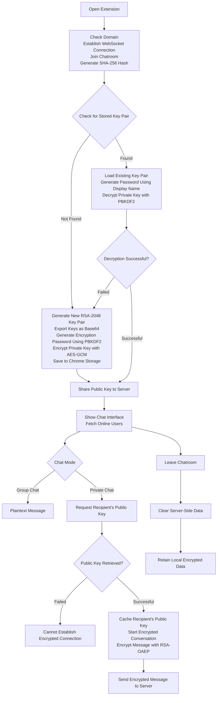
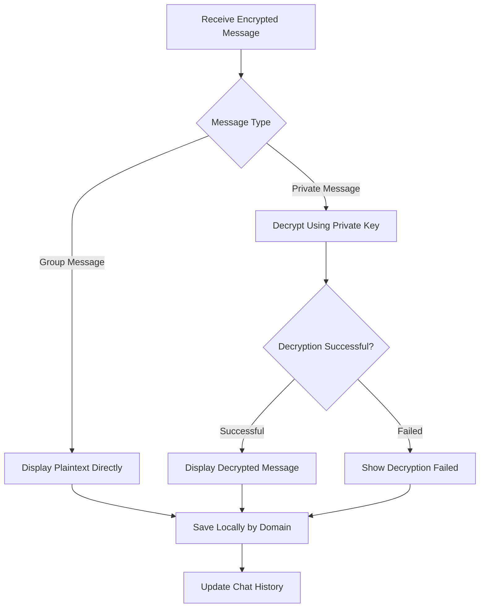

# C²hat - Cross-Domain Chat

## End-to-End Encryption Main Flow

## End-to-End Encryption Decryption Flow

## Key Management Flow
- Key Pair Generation: Use `RSA-2048` for asymmetric keys
- Local Private Key Encryption: Use `AES-GCM 256` for secure storage
- Password Derivation: Strengthen password with `PBKDF2`
- Key Persistence: Store keys using `Chrome Storage API`

## Message Encryption Flow
- Sender Encryption: Use recipient's public key for `RSA-OAEP`
- Receiver Decryption: Use private key to decrypt message content
- Group/Private Mode: Automatically determine message type, enforce encryption for private messages

## Privacy Protection Mechanisms
- Zero Server Storage: Server does not store any message content, Cloudflare Worker acts as a relay
- Local Encrypted Storage: Use `Chrome Storage API` for encrypted chat history
- Instant Cleanup: Clear server-side cache after connection termination

## Performance Optimization Features
- Key Caching: Cache recipient's public key after successful connection to reduce redundant requests
- Auto Reconnect: Automatically attempt reconnection if WebSocket disconnects
- Message Queue: Temporarily store messages during network instability

## Special Design
- Domain Isolation: Ensure complete separation of messages across different websites
